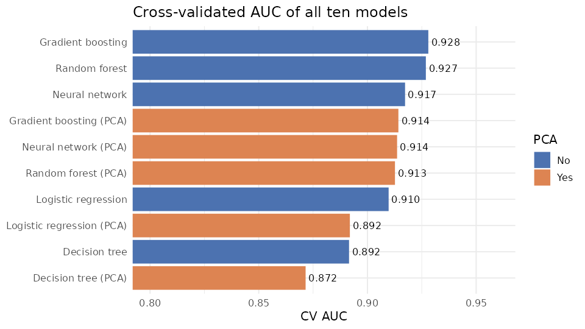
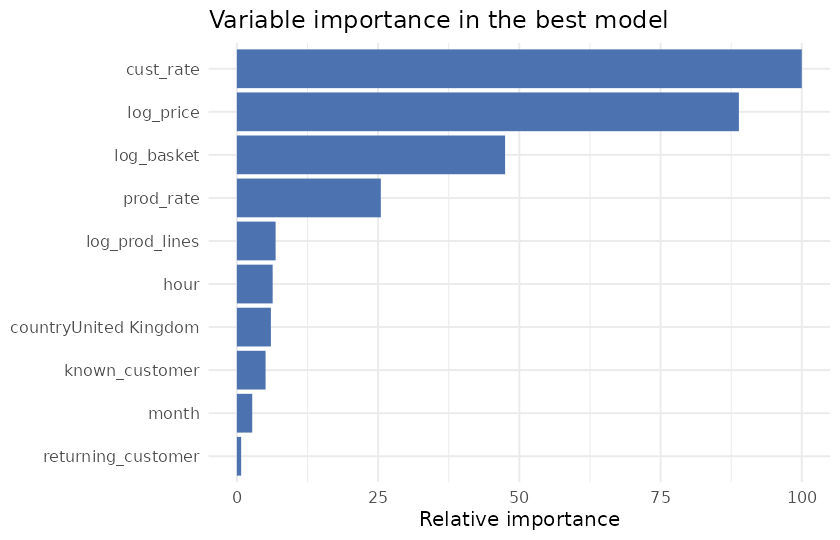

# Predicting High-Volume Purchases in E-commerce with Statistical Machine Learning

**[View the full report](https://htmlpreview.github.io/?https://github.com/ireneundiandeye/sml-ecommerce-prediction/blob/main/sml_ecommerce_high_volume_prediction.html)**

## Overview

This project, completed for the Statistical Machine Learning module of my MSc, builds and compares models that predict whether an order line in an online store will be a high-volume purchase, defined as 10 or more units of the same product. Anticipating bulk orders helps a retailer plan stock and fulfilment and identify trade customers for volume pricing. The analysis is written in R and fully reproducible from the R Markdown notebook.

## Data

The dataset contains 541,909 transaction lines from a UK-based online retailer of gifts and homeware between December 2010 and December 2011, with invoice and product identifiers, quantities, dates, unit prices, customer IDs and countries. After removing duplicates, cancellations, returns, non-product entries such as postage and fees, and lines with non-positive prices, 522,537 lines remain, of which 29% are high-volume.

## Approach

Twelve inputs were constructed, all of which would be known when an order is placed: the unit price, the number of products on the invoice, the customer's country, the time of the order, and each product's and customer's historical share of bulk purchases. Product and customer identifiers have thousands of levels, so instead of dummy variables they are summarised by these histories, which are computed from December 2010 to March 2011 and never used for modelling, so the target cannot leak into the inputs. Models are trained and evaluated on April to December 2011.

The train–test split and the 5-fold cross-validation are both grouped by invoice, so that lines from the same order never appear on both sides, which would otherwise inflate the scores. Five models were tuned and compared by cross-validated ROC AUC: logistic regression, a decision tree, a random forest, gradient boosting and a neural network in three configurations. All five were then rerun on principal components explaining 90% of the variance, with PCA fitted inside each fold, and the best of the ten models was evaluated once on a held-out test set of 77,606 lines.

## Key Findings

Gradient boosting performed best with a cross-validated AUC of 0.928, closely followed by the random forest at 0.927. On the held-out test set it achieved an AUC of 0.933 and an accuracy of 88%, identifying 77% of high-volume lines while correctly classifying 93% of low-volume ones. The close agreement between cross-validated and test performance shows that the evaluation is reliable.

The logistic regression reached an AUC of 0.910, only slightly below the ensembles, which shows that most of the predictive information lies in a few strong inputs. PCA reduced performance for every model, because the inputs carry largely distinct information and the components are chosen for variance rather than predictive power.

The customer's history of bulk buying is the most important predictor, followed by the unit price, the basket size and the product's history. Exploratory analysis supports this: bulk purchases involve cheaper items, are far more common among customers outside the UK, occur mostly in the morning, and are concentrated in orders with only a few distinct products.

## Improvements on the First Version

An earlier draft of this coursework could not be completed: the models crashed after trying to create thousands of dummy variables from product codes, cancellations were counted as low-volume purchases, a random split placed lines of the same order in both the training and test sets, and the ensemble, neural network, PCA and model selection sections were unfinished. This version resolves all of these issues.

## How to Run

Open `sml_ecommerce_high_volume_prediction.Rmd` in RStudio and click Knit, or run `rmarkdown::render("sml_ecommerce_high_volume_prediction.Rmd")`. The dataset is in `data/E-commerce.csv`. The required packages are dplyr, tidyr, lubridate, ggplot2, caret, ranger, gbm, rpart, nnet and pROC. A full run takes about 30 minutes, mainly for tuning the ensembles.

## Tools

R, caret, ranger, gbm, nnet, rpart, pROC, dplyr and ggplot2.
